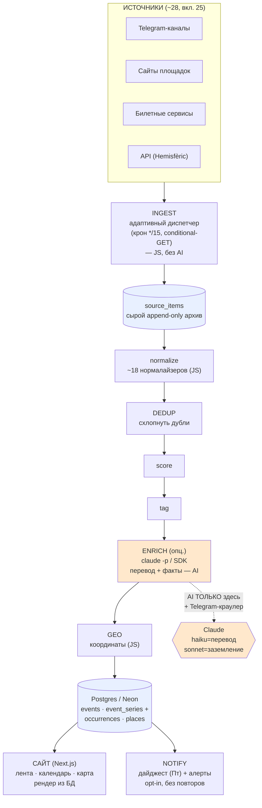

# Valencia Radar — архитектура (что получилось)

**Задача:** T166. **Дата:** 2026-06-21.

Человекопонятная схема того, как пост в Telegram-канале (или строчка на сайте площадки)
превращается в карточку события на сайте афиши. Без жаргона, по шагам.

---

## Картинка целиком

```
  ИСТОЧНИКИ (~28, включено 25)                  Telegram-каналы · сайты площадок
  ┌──────────────────────────────┐             билетные сервисы · API музеев
  │ tg-каналы  логунеспа,         │
  │            valenciarusa…      │
  │ сайты      visitvalencia,     │
  │            hoyvalencia…       │
  │ билеты     ticketmaster,      │
  │            eventbrite…        │
  │ API        Hemisfèric         │
  └──────────────┬───────────────┘
                 │
                 ▼
  ┌──────────────────────────────────────────────────────┐
  │ INGEST — адаптивный диспетчер                          │   ← деттерминированный JS
  │ • тик крона раз в 15 мин опрашивает ТОЛЬКО «созревшие» │     (без AI)
  │   источники (своя частота у каждого)                  │
  │ • conditional-GET: «не изменилось (304)» → пропускаем  │
  └──────────────┬───────────────────────────────────────┘
                 │  кладём СЫРЬЁ как есть, ничего не теряем
                 ▼
        ╔═══════════════════════════╗
        ║  source_items             ║   ← append-only сырой архив
        ║  (необработанные посты)   ║      (никогда не перезаписываем)
        ╚═════════════╤═════════════╝
                      │
                      ▼
  ┌─────────────────────────────────────────────────────────────────────────┐
  │ КОНВЕЙЕР (lib/pipeline/run.ts)                                            │
  │                                                                          │
  │  normalize ──► DEDUP ──► score ──► tag ──► [ ENRICH ] ──► GEO            │
  │  (~18 норма-  (схлоп-   (рей-    (метки)  (AI: перевод   (координаты)    │
  │   лайзеров,    нуть      тинг             + факты —                       │
  │   правила     дубли)    важно-            ТОЛЬКО локально)                │
  │   на JS)               сти)              ▲                                │
  │                                          │ claude -p / SDK                │
  │   ── всё JS, КРОМЕ ──────────────────────┘ (опционально)                  │
  └──────────────┬───────────────────────────────────────────────────────────┘
                 │
                 ▼
  ╔════════════════════════════════════════════════════════╗
  ║  Postgres (Neon)                                        ║
  ║  • events            — обычные события                  ║
  ║  • event_series +    — повторяющиеся (см. ниже)         ║
  ║    event_occurrences                                    ║
  ║  • places            — каталог мест                     ║
  ╚═══════════════╤════════════════════════════╤════════════╝
                  │                            │
                  ▼                            ▼
  ┌───────────────────────────┐   ┌──────────────────────────────┐
  │ САЙТ (Next.js)            │   │ NOTIFY                        │
  │ • лента карточек         │   │ • еженедельный дайджест (Пт)  │
  │ • календарь              │   │ • «редкое событие» — алерт    │
  │ • карта (Leaflet)        │   │ • opt-in, без повторов        │
  │ рендер ДЕТЕРМИНИРОВАННО   │   └──────────────────────────────┘
  │ из БД                    │
  └───────────────────────────┘
```

---

## Та же схема как Mermaid-флоучарт



---

## Легенда

| Обозначение | Что значит |
|---|---|
| 🟦 голубые блоки (`source_items`, Postgres) | хранилища данных |
| 🟧 оранжевые блоки (ENRICH, Claude) | **единственное место, где работает AI** |
| `[ ENRICH ]` в квадратных скобках | стадия **опциональна** — на prod по умолчанию выключена |
| append-only | сырьё только добавляется, никогда не перезаписывается и не удаляется |

---

## Где AI, а где нет (правило «JS прежде LLM», T140)

**AI (Claude) используется ровно в двух местах:**

1. **ENRICH** — перевод заголовка/описания на русский (**haiku**, дёшево) и заземлённое
   извлечение фактов: открыть ссылку-источник, прочитать страницу, достать точный адрес/часы/
   цену и **процитировать** их (**sonnet** — потолок надёжности). Никогда не выдумывает факты:
   если источник не подтверждает — оставляет пусто.
2. **Telegram-краулер** (`scripts/crawl-telegram.mjs`) — разбор исторических постов канала.

**Всё остальное — детерминированный JavaScript, без AI:** ingest, нормализация (~18
нормалайзеров с правилами и ключевыми словами), dedup, scoring, теги, геокодирование, рендер
сайта, уведомления. Это правило T140: дешёвый предсказуемый JS делает основную работу, дорогой
LLM — только там, где правилами не обойтись (перевод, чтение живых страниц).

---

## Местный bake vs prod-инкремент (главный приём)

Тяжёлые и/или платные стадии (AI-обогащение, геокодирование, dedup всей базы) гоняются
**ЛОКАЛЬНО** у владельца, на подписке Claude (маржинальная стоимость $0), и результат
**запекается** в файлы `data/seed/*.json`. Prod получает уже готовые, заполненные данные.

```
   ЛОКАЛЬНО (подписка, $0)                         PROD (Vercel)
   ┌────────────────────────────────┐       ┌─────────────────────────────┐
   │ ingest → normalize → dedup →   │       │ грузит ПРЕДЗАПОЛНЕННЫЙ seed  │
   │ score → tag → ENRICH → GEO     │ ───►  │ (data/seed/*.json)          │
   │ → npm run export-seed          │ push/ │ гоняет ТОЛЬКО инкремент-     │
   │ → data/seed/*.json             │deploy │ ingest, БЕЗ AI ($0 на серве)│
   └────────────────────────────────┘       └─────────────────────────────┘
```

На сегодня в seed запечено: **342 события** (все с русским `title_ru`, все с датой, 187 с
координатами на карте), **~74 места** от канала логунеспа (46 на карте), **28 источников**.
Prod ничего не считает на AI — он лишь отдаёт уже готовые карточки и добирает новые сырые
посты инкрементально. Подробности денег — в `specs/001-valencia-radar/cost-estimate.md`.

---

## Повторяющиеся события (Hemisfèric: 104 сеанса → 11 серий)

Кинотеатр-планетарий Hemisfèric крутит одни и те же ~11 фильмов много раз в день. Если бы
каждый сеанс был отдельной карточкой, лента превратилась бы в 104 одинаковых строчки. Поэтому
есть **модель серий**:

```
   104 сеанса ("показ X, вт 16:00", "показ X, ср 18:00"…)
                       │
                       ▼  группируем по фильму
   ┌─────────────────────────────────────────────┐
   │ event_series        — 11 «фильмов» (карточек)│  ← в ленте ОДНА карточка на фильм
   │ event_occurrences   — 104 конкретных сеанса  │  ← в календаре — расписание по дням
   └─────────────────────────────────────────────┘
```

В ленте показывается **одна карточка на серию** (с числом сеансов), а в календаре под ней
раскрывается расписание конкретных показов. Обогащение (перевод/факты) делается **один раз на
серию**, а не на каждый сеанс.

---

## Как живёт одна карточка — простыми словами

**Шаг 1.** В Telegram-канале (например, логунеспа) появляется пост: «Выставка Титаника,
вход 15 €, район Русафа». Диспетчер ingest замечает новый пост (он опрашивает быстрые каналы
примерно раз в 10–30 минут, медленные сайты — раз в сутки) и складывает его **как есть** в
сырой архив `source_items` — мы ничего не теряем и не переписываем.

**Шаг 2.** Нормалайзер этого канала (один из ~18, чистый JavaScript, без AI) разбирает текст по
правилам: находит дату, цену, место, категорию. Дальше dedup проверяет, что это же событие не
пришло уже из другого источника (если пришло — склеивает, сохраняя ссылку на оба источника),
scoring оценивает важность, теги навешивают метки. Затем — **только при локальном прогоне** —
включается Claude: переводит заголовок и описание на русский, а для проверенных фактов
открывает ссылку-источник, читает страницу и подтверждает точный адрес и цену цитатой.
Наконец геокодер превращает адрес в координаты для карты.

**Шаг 3.** Готовая карточка лежит в Postgres. Сайт (Next.js) рендерит её **детерминированно
из базы** — в ленте, в календаре по дате и точкой на карте. По пятницам система собирает
еженедельный дайджест, а на редкие/особые события шлёт отдельный алерт (по подписке, без
повторов). Всё, что попало на сайт — уже переведено, датировано и (по возможности) размещено
на карте, потому что тяжёлую работу сделали заранее локально и «запекли» в seed.
